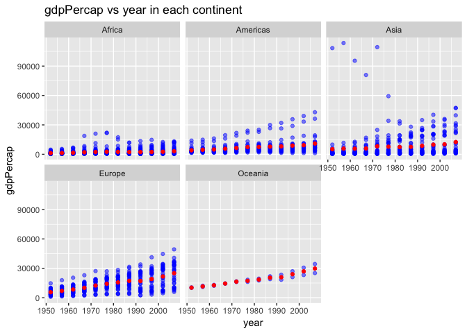
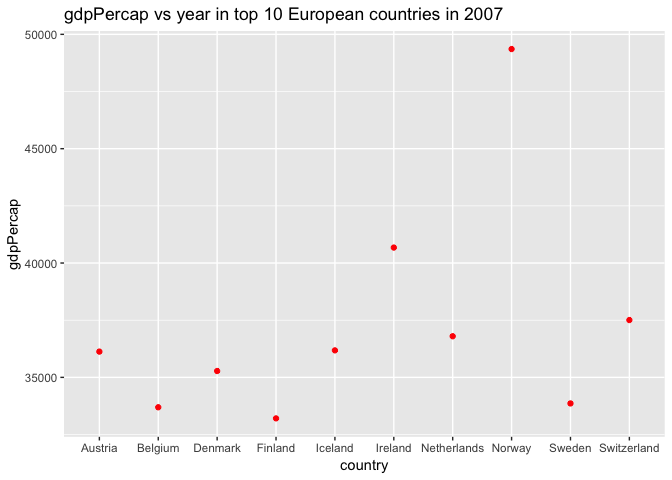
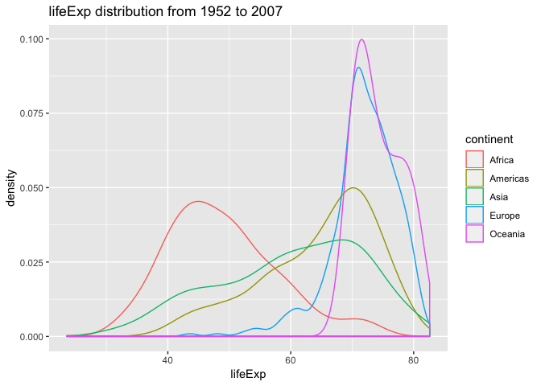

Hw02-Explore Gapminder and use dplyr
================

Load gapminder dataset and tidyverse and knitr packages.

``` r
library(gapminder)
library(tidyverse)
library(knitr)
```

## Small test of the data

  - **Is it a data.frame, a matrix, a vector, a list?**

<!-- end list -->

``` r
gapminder
```

    ## # A tibble: 1,704 x 6
    ##    country     continent  year lifeExp      pop gdpPercap
    ##    <fct>       <fct>     <int>   <dbl>    <int>     <dbl>
    ##  1 Afghanistan Asia       1952    28.8  8425333      779.
    ##  2 Afghanistan Asia       1957    30.3  9240934      821.
    ##  3 Afghanistan Asia       1962    32.0 10267083      853.
    ##  4 Afghanistan Asia       1967    34.0 11537966      836.
    ##  5 Afghanistan Asia       1972    36.1 13079460      740.
    ##  6 Afghanistan Asia       1977    38.4 14880372      786.
    ##  7 Afghanistan Asia       1982    39.9 12881816      978.
    ##  8 Afghanistan Asia       1987    40.8 13867957      852.
    ##  9 Afghanistan Asia       1992    41.7 16317921      649.
    ## 10 Afghanistan Asia       1997    41.8 22227415      635.
    ## # ... with 1,694 more rows

Look at the structure of
    gapminder

``` r
str(gapminder)
```

    ## Classes 'tbl_df', 'tbl' and 'data.frame':    1704 obs. of  6 variables:
    ##  $ country  : Factor w/ 142 levels "Afghanistan",..: 1 1 1 1 1 1 1 1 1 1 ...
    ##  $ continent: Factor w/ 5 levels "Africa","Americas",..: 3 3 3 3 3 3 3 3 3 3 ...
    ##  $ year     : int  1952 1957 1962 1967 1972 1977 1982 1987 1992 1997 ...
    ##  $ lifeExp  : num  28.8 30.3 32 34 36.1 ...
    ##  $ pop      : int  8425333 9240934 10267083 11537966 13079460 14880372 12881816 13867957 16317921 22227415 ...
    ##  $ gdpPercap: num  779 821 853 836 740 ...

Obviously, gapminder is a data frame. More specifically, it is a
“tibble”.

  - **What is its class?**

<!-- end list -->

``` r
class(gapminder)
```

    ## [1] "tbl_df"     "tbl"        "data.frame"

It seems like gapminder is a table and data frame.

  - **How many variables/columns?**

<!-- end list -->

``` r
ncol(gapminder)
```

    ## [1] 6

  - **How many rows/observations?**

<!-- end list -->

``` r
nrow(gapminder)
```

    ## [1] 1704

  - **Can you get these facts about “extent” or “size” in more than one
    way? Can you imagine different functions being useful in different
    contexts?**

`dim()` function can be used to get the number of rows and columns.

``` r
dim(gapminder)
```

    ## [1] 1704    6

`summary()` and `str()` can help us get the content summary of
gapminder.

``` r
summary(gapminder)
```

    ##         country        continent        year         lifeExp     
    ##  Afghanistan:  12   Africa  :624   Min.   :1952   Min.   :23.60  
    ##  Albania    :  12   Americas:300   1st Qu.:1966   1st Qu.:48.20  
    ##  Algeria    :  12   Asia    :396   Median :1980   Median :60.71  
    ##  Angola     :  12   Europe  :360   Mean   :1980   Mean   :59.47  
    ##  Argentina  :  12   Oceania : 24   3rd Qu.:1993   3rd Qu.:70.85  
    ##  Australia  :  12                  Max.   :2007   Max.   :82.60  
    ##  (Other)    :1632                                                
    ##       pop              gdpPercap       
    ##  Min.   :6.001e+04   Min.   :   241.2  
    ##  1st Qu.:2.794e+06   1st Qu.:  1202.1  
    ##  Median :7.024e+06   Median :  3531.8  
    ##  Mean   :2.960e+07   Mean   :  7215.3  
    ##  3rd Qu.:1.959e+07   3rd Qu.:  9325.5  
    ##  Max.   :1.319e+09   Max.   :113523.1  
    ## 

``` r
str(gapminder)
```

    ## Classes 'tbl_df', 'tbl' and 'data.frame':    1704 obs. of  6 variables:
    ##  $ country  : Factor w/ 142 levels "Afghanistan",..: 1 1 1 1 1 1 1 1 1 1 ...
    ##  $ continent: Factor w/ 5 levels "Africa","Americas",..: 3 3 3 3 3 3 3 3 3 3 ...
    ##  $ year     : int  1952 1957 1962 1967 1972 1977 1982 1987 1992 1997 ...
    ##  $ lifeExp  : num  28.8 30.3 32 34 36.1 ...
    ##  $ pop      : int  8425333 9240934 10267083 11537966 13079460 14880372 12881816 13867957 16317921 22227415 ...
    ##  $ gdpPercap: num  779 821 853 836 740 ...

Sometimes we just want to filter one column of gapminder. For example,
we want to see how many countries included in gapminder.

``` r
length(unique(gapminder$country))
```

    ## [1] 142

  - **What data type is each variable?**

<!-- end list -->

``` r
typeof(gapminder$country)
```

    ## [1] "integer"

``` r
typeof(gapminder$continent)
```

    ## [1] "integer"

``` r
typeof(gapminder$year)
```

    ## [1] "integer"

``` r
typeof(gapminder$lifeExp)
```

    ## [1] "double"

``` r
typeof(gapminder$pop)
```

    ## [1] "integer"

``` r
typeof(gapminder$gdpPercap)
```

    ## [1] "double"

## Explore individual variables

**Categorical variable: country and continent**

Let us look at possible values of continent.

``` r
unique(select(gapminder,continent))
```

    ## # A tibble: 5 x 1
    ##   continent
    ##   <fct>    
    ## 1 Asia     
    ## 2 Europe   
    ## 3 Africa   
    ## 4 Americas 
    ## 5 Oceania

5 continents are listed in the gapminder.

Then we will explore the number of countries in each continent.

``` r
group_by(gapminder,continent)%>%
  summarise(numOfcountries=length(unique(country)))%>%
  ggplot(aes(x=continent,weight=numOfcountries))+geom_bar()+
  labs(title="The number of countries in each continent",x="continent",      y="number of countries")
```

<!-- -->

Next, find out how many countries are listed?

``` r
unique(select(gapminder,country))
```

    ## # A tibble: 142 x 1
    ##    country    
    ##    <fct>      
    ##  1 Afghanistan
    ##  2 Albania    
    ##  3 Algeria    
    ##  4 Angola     
    ##  5 Argentina  
    ##  6 Australia  
    ##  7 Austria    
    ##  8 Bahrain    
    ##  9 Bangladesh 
    ## 10 Belgium    
    ## # ... with 132 more rows

142 countries are included in the gapminder.

Then let us explore how many entries for each country in this dataset.
Take Canada as an example:

``` r
filter(gapminder,country=="Canada") %>%
 select(country,year)
```

    ## # A tibble: 12 x 2
    ##    country  year
    ##    <fct>   <int>
    ##  1 Canada   1952
    ##  2 Canada   1957
    ##  3 Canada   1962
    ##  4 Canada   1967
    ##  5 Canada   1972
    ##  6 Canada   1977
    ##  7 Canada   1982
    ##  8 Canada   1987
    ##  9 Canada   1992
    ## 10 Canada   1997
    ## 11 Canada   2002
    ## 12 Canada   2007

It shows that there are 12 entries for each country, every 5 years as an
interval.

**Quantitative variables: lifeExp, year, gdpPercap**

let’s start with year.

``` r
range(gapminder$year)
```

    ## [1] 1952 2007

It shows that the data in the gapminder is from year 1952 to 2007.

Next we explore gdpPercap.

``` r
summary(gapminder$gdpPercap)
```

    ##     Min.  1st Qu.   Median     Mean  3rd Qu.     Max. 
    ##    241.2   1202.1   3531.8   7215.3   9325.5 113523.1

The range is from 241.2 to 113523.1. It is a big range\!

Then we can make a table to demonstrate the gdpPercap summary in
different continents from 1952 to 2007.

``` r
group_by(gapminder,continent)%>%
  summarize(minValue=min(gdpPercap), 
            medianValue=median(gdpPercap),
            maxValue=max(gdpPercap))%>%kable()
```

| continent |   minValue | medianValue |  maxValue |
| :-------- | ---------: | ----------: | --------: |
| Africa    |   241.1659 |    1192.138 |  21951.21 |
| Americas  |  1201.6372 |    5465.510 |  42951.65 |
| Asia      |   331.0000 |    2646.787 | 113523.13 |
| Europe    |   973.5332 |   12081.749 |  49357.19 |
| Oceania   | 10039.5956 |   17983.304 |  34435.37 |

In 2007, we can find out which country has highest gdpPercap?

``` r
filter(gapminder,year==2007)%>%
  arrange(desc(gdpPercap))%>%
  select(country,gdpPercap)%>%
  head(10)
```

    ## # A tibble: 10 x 2
    ##    country          gdpPercap
    ##    <fct>                <dbl>
    ##  1 Norway              49357.
    ##  2 Kuwait              47307.
    ##  3 Singapore           47143.
    ##  4 United States       42952.
    ##  5 Ireland             40676.
    ##  6 Hong Kong, China    39725.
    ##  7 Switzerland         37506.
    ##  8 Netherlands         36798.
    ##  9 Canada              36319.
    ## 10 Iceland             36181.

Norway has top gdpPercap in 2007\!

Then we can graph gdpPercap in 2007 as a histogram.

``` r
filter(gapminder,year==2007)%>%
  ggplot(aes(x=gdpPercap))+
  geom_histogram(bins=50)+
  labs(title="Histogram of gdpPercap in 2007")
```

<!-- -->

Finally, we explore lifeExp variable.

``` r
summary(gapminder$lifeExp)
```

    ##    Min. 1st Qu.  Median    Mean 3rd Qu.    Max. 
    ##   23.60   48.20   60.71   59.47   70.85   82.60

like above, make a table to show mean values of lifeExp in 1952 and 2007
on different continents.

``` r
filter(gapminder,year==1952|year==2007)%>%
  group_by(continent,year)%>%
  summarize(meanValue=mean(lifeExp))%>%
  kable()
```

| continent | year | meanValue |
| :-------- | ---: | --------: |
| Africa    | 1952 |  39.13550 |
| Africa    | 2007 |  54.80604 |
| Americas  | 1952 |  53.27984 |
| Americas  | 2007 |  73.60812 |
| Asia      | 1952 |  46.31439 |
| Asia      | 2007 |  70.72848 |
| Europe    | 1952 |  64.40850 |
| Europe    | 2007 |  77.64860 |
| Oceania   | 1952 |  69.25500 |
| Oceania   | 2007 |  80.71950 |

We can find that mean value of lifeExp in each continent has a big
increase.

Next, we will graph mean value of lifeExp in each continent from 1952 to
2007.

``` r
group_by(gapminder,continent,year)%>%
  summarise(meanVal=mean(lifeExp))%>%
  ggplot(aes(x=year,y=meanVal,color=continent))+
  geom_point()+
  geom_smooth(se=FALSE)+
  labs(title="mean value of lifeExp in each continent")
```

    ## `geom_smooth()` using method = 'loess' and formula 'y ~ x'

<!-- -->

## **Explore various plot types**

**Scatterplot**

let’s begin with pop variable.

Firstly, we explore pop in each continent from 1952 to 2007.

``` r
ggplot(gapminder,aes(x=continent,y=pop))+
  geom_point(alpha=0.2,color="blue")+
  stat_summary(fun.y=mean,color="red",geom = "point")+
  labs(title="population in each continent from 1952 to 2007")
```

<!-- -->

Some countries in Asia has quite a big population.

Next, compare population of China and Canada.

``` r
filter(gapminder,country=="China"|country=="Canada")%>%
  ggplot(aes(x=year,y=pop,color=country))+geom_point(alpha=0.5)+
  geom_smooth(se=FALSE)+
  labs(title="population of China and Canada")
```

    ## `geom_smooth()` using method = 'loess' and formula 'y ~ x'

<!-- -->

That is amazing\! The population difference between two countries is
quite big.

Next variable we want to explore is gdpPercap vs year.

We want to graph gdpPercap vs year in every continent.

``` r
ggplot(gapminder,aes(x=year,y=gdpPercap))+
  geom_point(color="blue")+
  stat_summary(fun.y=mean,color="red",geom = "point")+
  facet_wrap(~continent)+
  labs(title="gdpPercap vs year in each continent")
```

<!-- -->

Then we can look at gdpPercap in top 10 European countries in 2007.

``` r
filter(gapminder,year==2007,continent=="Europe")%>%
  arrange(desc(gdpPercap))%>%
  head(10)%>%
  select(country,gdpPercap)%>%
  ggplot(aes(x=country,y=gdpPercap))+
  geom_point(color="red")+
  labs(title="gdpPercap vs year in top 10 European countries in 2007")
```

<!-- -->

**Histogram and density plot**

Let’s see lifeExp distribution from 1952 to 2007.

``` r
  ggplot(gapminder,aes(x=lifeExp,fill=continent))+
  geom_histogram()+
  labs(title="lifeExp distribution from 1952 to 2007")
```

    ## `stat_bin()` using `bins = 30`. Pick better value with `binwidth`.

<!-- -->

Next look at the density plot of lifeExp distribution from 1952 to 2007.

``` r
  ggplot(gapminder,aes(x=lifeExp,color=continent))+
  geom_density()+
  labs(title="lifeExp distribution from 1952 to 2007")
```

<!-- -->

**Barplot**

let’s see the total population of each continent in 2007.

``` r
filter(gapminder,year==2007)%>%
  group_by(continent)%>%
  summarise(total = sum(as.numeric(pop)))%>%
  ggplot(aes(x=continent,weight=total))+
  geom_bar()+labs(title="total population of each continent in 2007",x="continent",y="population")
```

<!-- -->

Let’s see total gdp of each continent in 2007.

``` r
e<-filter(gapminder,year==2007)%>%
   group_by(continent,country)%>%
   summarise(country_gdp=pop*gdpPercap)%>%
   group_by(continent)%>%
   summarise(total_gdp=sum(country_gdp))
ggplot(e,aes(x=continent,weight=total_gdp))+
  geom_bar()+
  labs(title="total gdp of each continent in 2007",x="continent",y="total gdp")
```

<!-- -->

## **But I want to do more\!**

``` r
filter(gapminder,country==c("Rwanda", "Afghanistan"))%>%kable()
```

| country     | continent | year | lifeExp |      pop | gdpPercap |
| :---------- | :-------- | ---: | ------: | -------: | --------: |
| Afghanistan | Asia      | 1957 |  30.332 |  9240934 |  820.8530 |
| Afghanistan | Asia      | 1967 |  34.020 | 11537966 |  836.1971 |
| Afghanistan | Asia      | 1977 |  38.438 | 14880372 |  786.1134 |
| Afghanistan | Asia      | 1987 |  40.822 | 13867957 |  852.3959 |
| Afghanistan | Asia      | 1997 |  41.763 | 22227415 |  635.3414 |
| Afghanistan | Asia      | 2007 |  43.828 | 31889923 |  974.5803 |
| Rwanda      | Africa    | 1952 |  40.000 |  2534927 |  493.3239 |
| Rwanda      | Africa    | 1962 |  43.000 |  3051242 |  597.4731 |
| Rwanda      | Africa    | 1972 |  44.600 |  3992121 |  590.5807 |
| Rwanda      | Africa    | 1982 |  46.218 |  5507565 |  881.5706 |
| Rwanda      | Africa    | 1992 |  23.599 |  7290203 |  737.0686 |
| Rwanda      | Africa    | 2002 |  43.413 |  7852401 |  785.6538 |

Obviously, this output is not correct, missing some information.

There are two ways to correct it.

First method:

``` r
filter(gapminder,country=="Rwanda"|country=="Afghanistan")%>%kable()
```

| country     | continent | year | lifeExp |      pop | gdpPercap |
| :---------- | :-------- | ---: | ------: | -------: | --------: |
| Afghanistan | Asia      | 1952 |  28.801 |  8425333 |  779.4453 |
| Afghanistan | Asia      | 1957 |  30.332 |  9240934 |  820.8530 |
| Afghanistan | Asia      | 1962 |  31.997 | 10267083 |  853.1007 |
| Afghanistan | Asia      | 1967 |  34.020 | 11537966 |  836.1971 |
| Afghanistan | Asia      | 1972 |  36.088 | 13079460 |  739.9811 |
| Afghanistan | Asia      | 1977 |  38.438 | 14880372 |  786.1134 |
| Afghanistan | Asia      | 1982 |  39.854 | 12881816 |  978.0114 |
| Afghanistan | Asia      | 1987 |  40.822 | 13867957 |  852.3959 |
| Afghanistan | Asia      | 1992 |  41.674 | 16317921 |  649.3414 |
| Afghanistan | Asia      | 1997 |  41.763 | 22227415 |  635.3414 |
| Afghanistan | Asia      | 2002 |  42.129 | 25268405 |  726.7341 |
| Afghanistan | Asia      | 2007 |  43.828 | 31889923 |  974.5803 |
| Rwanda      | Africa    | 1952 |  40.000 |  2534927 |  493.3239 |
| Rwanda      | Africa    | 1957 |  41.500 |  2822082 |  540.2894 |
| Rwanda      | Africa    | 1962 |  43.000 |  3051242 |  597.4731 |
| Rwanda      | Africa    | 1967 |  44.100 |  3451079 |  510.9637 |
| Rwanda      | Africa    | 1972 |  44.600 |  3992121 |  590.5807 |
| Rwanda      | Africa    | 1977 |  45.000 |  4657072 |  670.0806 |
| Rwanda      | Africa    | 1982 |  46.218 |  5507565 |  881.5706 |
| Rwanda      | Africa    | 1987 |  44.020 |  6349365 |  847.9912 |
| Rwanda      | Africa    | 1992 |  23.599 |  7290203 |  737.0686 |
| Rwanda      | Africa    | 1997 |  36.087 |  7212583 |  589.9445 |
| Rwanda      | Africa    | 2002 |  43.413 |  7852401 |  785.6538 |
| Rwanda      | Africa    | 2007 |  46.242 |  8860588 |  863.0885 |

Second method:

``` r
filter(gapminder,country %in% c("Rwanda","Afghanistan"))%>%kable()
```

| country     | continent | year | lifeExp |      pop | gdpPercap |
| :---------- | :-------- | ---: | ------: | -------: | --------: |
| Afghanistan | Asia      | 1952 |  28.801 |  8425333 |  779.4453 |
| Afghanistan | Asia      | 1957 |  30.332 |  9240934 |  820.8530 |
| Afghanistan | Asia      | 1962 |  31.997 | 10267083 |  853.1007 |
| Afghanistan | Asia      | 1967 |  34.020 | 11537966 |  836.1971 |
| Afghanistan | Asia      | 1972 |  36.088 | 13079460 |  739.9811 |
| Afghanistan | Asia      | 1977 |  38.438 | 14880372 |  786.1134 |
| Afghanistan | Asia      | 1982 |  39.854 | 12881816 |  978.0114 |
| Afghanistan | Asia      | 1987 |  40.822 | 13867957 |  852.3959 |
| Afghanistan | Asia      | 1992 |  41.674 | 16317921 |  649.3414 |
| Afghanistan | Asia      | 1997 |  41.763 | 22227415 |  635.3414 |
| Afghanistan | Asia      | 2002 |  42.129 | 25268405 |  726.7341 |
| Afghanistan | Asia      | 2007 |  43.828 | 31889923 |  974.5803 |
| Rwanda      | Africa    | 1952 |  40.000 |  2534927 |  493.3239 |
| Rwanda      | Africa    | 1957 |  41.500 |  2822082 |  540.2894 |
| Rwanda      | Africa    | 1962 |  43.000 |  3051242 |  597.4731 |
| Rwanda      | Africa    | 1967 |  44.100 |  3451079 |  510.9637 |
| Rwanda      | Africa    | 1972 |  44.600 |  3992121 |  590.5807 |
| Rwanda      | Africa    | 1977 |  45.000 |  4657072 |  670.0806 |
| Rwanda      | Africa    | 1982 |  46.218 |  5507565 |  881.5706 |
| Rwanda      | Africa    | 1987 |  44.020 |  6349365 |  847.9912 |
| Rwanda      | Africa    | 1992 |  23.599 |  7290203 |  737.0686 |
| Rwanda      | Africa    | 1997 |  36.087 |  7212583 |  589.9445 |
| Rwanda      | Africa    | 2002 |  43.413 |  7852401 |  785.6538 |
| Rwanda      | Africa    | 2007 |  46.242 |  8860588 |  863.0885 |
